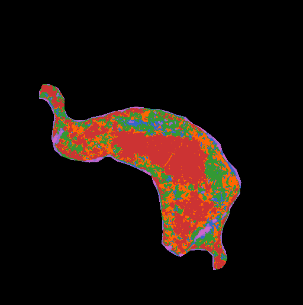
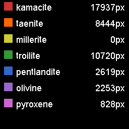
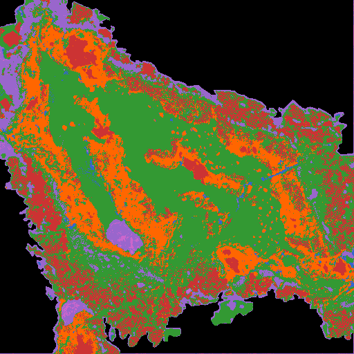

## meteorite-mineral-mapping

### Addressing [Meterorite Mineral Mapping](https://github.com/amnh/HackTheSolarSystem/wiki/Meteorite-Mineral-Mapping)

### Created by

- Clyde Shaffer [@clydeshaffer](https://github.com/clydeshaffer)
- Xiaoyun Yang [@xiaoyunyang](https://github.com/xiaoyunyang)

### Solution Description

See [slides for Demo Day](https://docs.google.com/presentation/d/1vgvUrzNKKyIVOv5fUPATqIRv6TOE3N-T2gS-2qjjIIM/edit?usp=sharing)

There are two phases to the solution. Phase 1 is to create conversion factors which correlate intensity values and weight% for every element. Phase 2 is to use the conversion factors to identify minerals in a sample.

For Phase 1, we created a program called [Calibrator](src/calibrator/main.py) which uses (1) [standards.json](dataset/standard/standards.json) and (2) data files in the [standard](dataset/standard) directory to calculate weight%-to-intensity conversion factor for each element. Standards are minerals with known exact compositions. For each standard, we applied mask for the standard onto the elements which are in the standard's chemical composition to get the number representing the element's intensity value. For each element of each standard the conversion factor is calculated from dividing the intensity value by the weight% of the element in the standard. We maintain a running average of the intensity values for every element as we iterate through all the standards. At the end of the program, a file called [calibration.json](dataset/calibration.json) is created which contains the mapping between element names and their weight%-to-intensity conversion factors.

For Phase 2, we created a program called [Identifier](src/identifier/main.py) which uses (1) [calibration.json](dataset/calibration.json) (output of Phase 1), (2) [test-minerals.json](dataset/test-minerals.json) (minerals which we want to test for in the samples), and data files for the sample ([obj1](dataset/obj1) and [obj2](dataset/obj2)) to calculate (1) a mineral map, (2) a confidence map, and (3) mineral counts for the sample. For each element of each test mineral, we calculate the intensity value using the weight%-to-intensity conversion factor. Then we calculate the delta between the calculated intensity value and the intensity value of the sample at a given pixel for each element. We sum up the deltas for all the elements for each test mineral and we keep track of the smallest deltaSum as we compare all the test minerals against the sample. At the end of processing, we can deduce that the most likely mineral at a given pixel is the one with the smallest delta sum. The mineral map is created by color coding each pixel of the sample image with the color representing the test mineral. The confidence map is a gray scale calculated from the deltaSum of the chosen mineral at every pixel. Mineral counts is basically a mapping of test mineral name to the number of pixels in the sample in which the mineral appears.

#### Object 1

mineral map




confidence


Mineral counts

[obj1_mineralcounts.json](dataset/obj1_mineralcounts.json)

#### Object 2

mineral map




confidence


[obj2_mineral counts](dataset/obj2_mineralcounts.json)

### Installation Instructions

Download the project:

```
git clone https://github.com/HackTheSolarSystem/meteorite-mineral-mapping.git
```

To run the project

1. Install python
    - OPTIONAL: if you want to run the version of the programs which utilizes parallel processing on the GPU, you also need to install [numba](https://pypi.org/project/numba/), [cudatoolkit](https://developer.nvidia.com/cuda-toolkit), and [pyculib](https://github.com/numba/pyculib/blob/master/docs/quickstart.md). Using the CUDA versions of the program will result in roughly a 10x faster execution.
2. Install [yarn](https://www.google.com/search?q=yarn+install&oq=yarn+install&aqs=chrome..69i57j0l5.1257j0j7&sourceid=chrome&ie=UTF-8)
3. Execute the program for creating the calibration file: `yarn calibrate`
    - NOTE: `yarn calibrate` executes the [calibrator](/src/calibrator/main.py), which creates [calibration.json](/dataset/calibration.json). This file contains the conversion factor that correlates intensity and weight percent for each element.
4. After calibration, identify minerals in obj1 obj2 using `yarn identify-obj1` and `yarn identify-obj2`.
    - NOTE: the bash commands which map to the yarn commands are defined in the scripts section of [package.json](package.json). To identify additional objects, ensure to create a new directory in [dataset](/dataset) and name it `{OBJET_NAME}`, then add a script to package.json which maps "identify-`{OBJECT_NAME}`" to "cd dataset && python ../src/identifier/main.py `{OBJECT_NAME}`".

